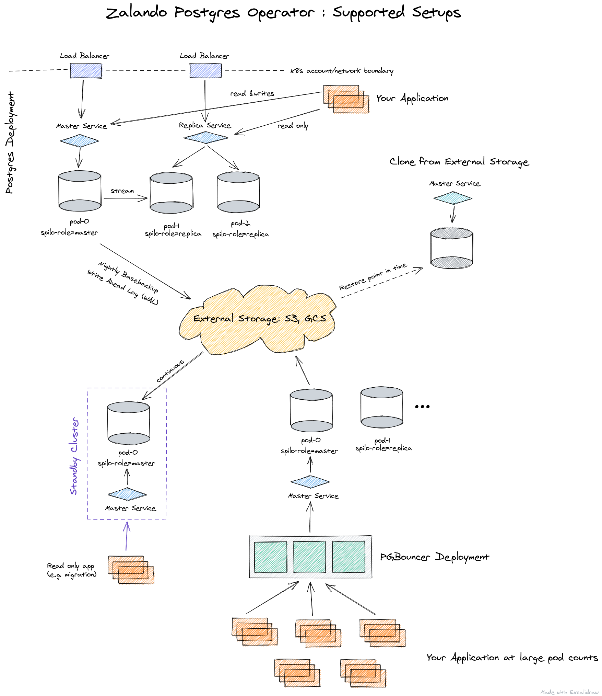

# Postgres Operator

The Postgres Operator delivers an easy to run highly-available [PostgreSQL](https://www.postgresql.org/)
clusters on Kubernetes (K8s) powered by [Patroni](https://github.com/zalando/spilo).
It is configured only through Postgres manifests (CRDs) to ease integration into automated CI/CD
pipelines with no access to Kubernetes API directly, promoting infrastructure as code vs manual operations.

### Operator features

* Rolling updates on Postgres cluster changes, incl. quick minor version updates
* Live volume resize without pod restarts (AWS EBS, PVC)
* Database connection pooler with PGBouncer
* Restore and cloning Postgres clusters (incl. major version upgrade)
* Additionally logical backups to S3 bucket can be configured
* Standby cluster from S3 WAL archive
* Configurable for non-cloud environments
* Basic credential and user management on K8s, eases application deployments
* Support for custom TLS certificates
* UI to create and edit Postgres cluster manifests
* Works well on Amazon AWS, Google Cloud, OpenShift and locally on Kind
* Base support for AWS EBS gp3 migration (iops, throughput pending)

### PostgreSQL features

* Supports PostgreSQL 13, starting from 9.5+
* Streaming replication cluster via Patroni
* Point-In-Time-Recovery with
[pg_basebackup](https://www.postgresql.org/docs/11/app-pgbasebackup.html) /
[WAL-E](https://github.com/wal-e/wal-e) via [Spilo](https://github.com/zalando/spilo)
* Preload libraries: [bg_mon](https://github.com/CyberDem0n/bg_mon),
[pg_stat_statements](https://www.postgresql.org/docs/9.4/pgstatstatements.html),
[pgextwlist](https://github.com/dimitri/pgextwlist),
[pg_auth_mon](https://github.com/RafiaSabih/pg_auth_mon)
* Incl. popular Postgres extensions such as
[decoderbufs](https://github.com/debezium/postgres-decoderbufs),
[hypopg](https://github.com/HypoPG/hypopg),
[pg_cron](https://github.com/citusdata/pg_cron),
[pg_partman](https://github.com/pgpartman/pg_partman),
[pg_stat_kcache](https://github.com/powa-team/pg_stat_kcache),
[pgq](https://github.com/pgq/pgq),
[plpgsql_check](https://github.com/okbob/plpgsql_check),
[postgis](https://postgis.net/),
[set_user](https://github.com/pgaudit/set_user) and
[timescaledb](https://github.com/timescale/timescaledb)

The Postgres Operator has been developed at Zalando and is being used in
production for over three years.

## Notes on Postgres 13 support

If you are new to the operator, you can skip this and just start using the Postgres operator as is, Postgres 13 is ready to go.

The Postgres operator supports Postgres 13 with the new Spilo Image that includes also the recent Patroni version to support PG13 settings.
More work on optimizing restarts and rolling upgrades is pending.

If you are already using the Postgres operator in older version with a Spilo 12 Docker image you need to be aware of the changes for the backup path.
We introduce the major version into the backup path to smoothen the [major version upgrade](docs/administrator.md#minor-and-major-version-upgrade) that is now supported manually.

The new operator configuration can set a compatibility flag *enable_spilo_wal_path_compat* to make Spilo look for wal segments in the current path but also old format paths.
This comes at potential performance costs and should be disabled after a few days.

The new Spilo 13 image is: `registry.opensource.zalan.do/acid/spilo-13:2.0-p2`

The last Spilo 12 image is: `registry.opensource.zalan.do/acid/spilo-12:1.6-p5`

## Getting started

For a quick first impression follow the instructions of this
[tutorial](docs/quickstart.md).

## Supported setups of Postgres and Applications

## Documentation

There is a browser-friendly version of this documentation at
[postgres-operator.readthedocs.io](https://postgres-operator.readthedocs.io)

* [How it works](docs/index.md)
* [Installation](docs/quickstart.md#deployment-options)
* [The Postgres experience on K8s](docs/user.md)
* [The Postgres Operator UI](docs/operator-ui.md)
* [DBA options - from RBAC to backup](docs/administrator.md)
* [Build, debug and extend the operator](docs/developer.md)
* [Configuration options](docs/reference/operator_parameters.md)
* [Postgres manifest reference](docs/reference/cluster_manifest.md)
* [Command-line options and environment variables](docs/reference/command_line_and_environment.md)

## Community

There are two places to get in touch with the community:
1. The [GitHub issue tracker](https://github.com/zalando/postgres-operator/issues)
2. The **#postgres-operator** [slack channel](https://postgres-slack.herokuapp.com)
