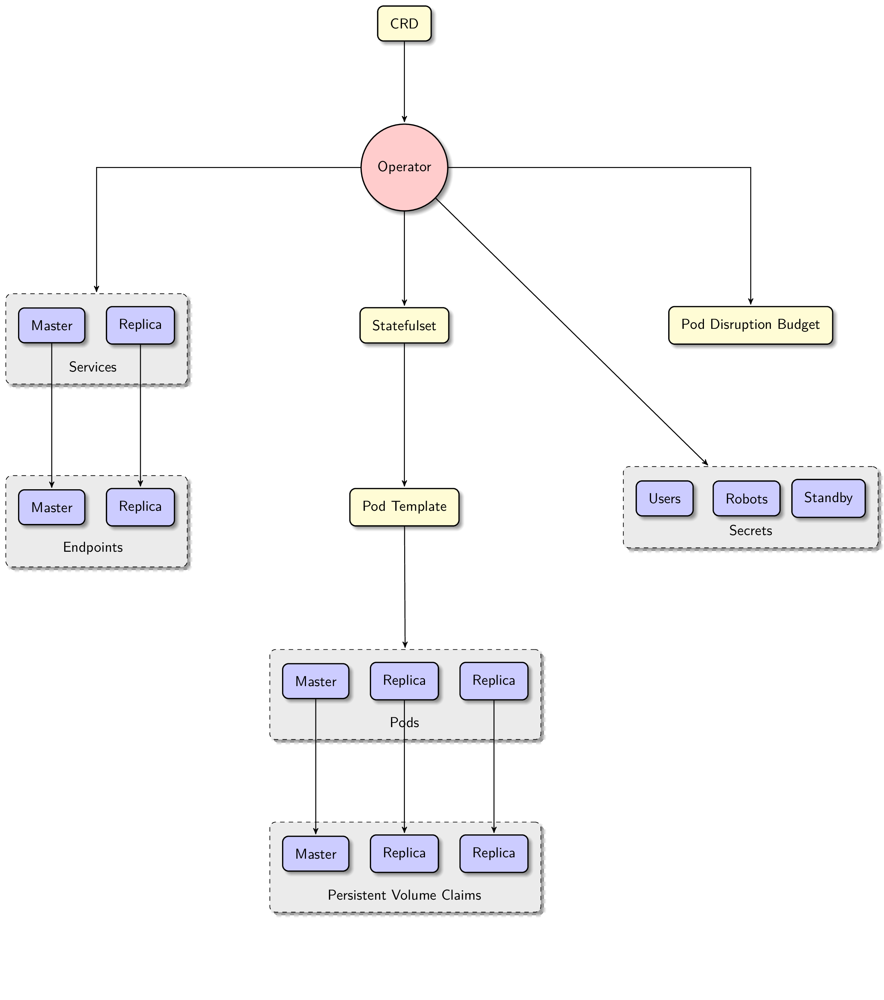

<h1>Concepts</h1>

The Postgres [operator](https://coreos.com/blog/introducing-operators.html)
manages PostgreSQL clusters on Kubernetes (K8s):

1. The operator watches additions, updates, and deletions of PostgreSQL cluster
   manifests and changes the running clusters accordingly.  For example, when a
   user submits a new manifest, the operator fetches that manifest and spawns a
   new Postgres cluster along with all necessary entities such as K8s
   StatefulSets and Postgres roles.  See this
   [Postgres cluster manifest](../manifests/complete-postgres-manifest.yaml)
   for settings that a manifest may contain.

2. The operator also watches updates to [its own configuration](../manifests/configmap.yaml)
   and alters running Postgres clusters if necessary.  For instance, if the
   docker image in a pod is changed, the operator carries out the rolling
   update, which means it re-spawns pods of each managed StatefulSet one-by-one
   with the new Docker image.

3. Finally, the operator periodically synchronizes the actual state of each
   Postgres cluster with the desired state defined in the cluster's manifest.

4. The operator aims to be hands free as configuration works only via manifests.
   This enables easy integration in automated deploy pipelines with no access to
   K8s directly.

## Scope

The scope of the Postgres Operator is on provisioning, modifying configuration
and cleaning up Postgres clusters that use Patroni, basically to make it easy
and convenient to run Patroni based clusters on K8s. The provisioning
and modifying includes K8s resources on one side but also e.g. database
and role provisioning once the cluster is up and running. We try to leave as
much work as possible to K8s and to Patroni where it fits, especially
the cluster bootstrap and high availability. The operator is however involved
in some overarching orchestration, like rolling updates to improve the user
experience.

Monitoring or tuning Postgres is not in scope of the operator in the current
state. Other tools like [ZMON](https://opensource.zalando.com/zmon/),
[Prometheus](https://prometheus.io/) or more Postgres specific options can be
used to complement it.

## Overview of involved entities

Here is a diagram, that summarizes what would be created by the operator, when a
new Postgres cluster CRD is submitted:

This picture is not complete without an overview of what is inside a single
cluster pod, so let's zoom in:

These two diagrams should help you to understand the basics of what kind of
functionality the operator provides.

## Status

This project is currently in active development. It is however already
[used internally by Zalando](https://jobs.zalando.com/tech/blog/postgresql-in-a-time-of-kubernetes/)
in order to run Postgres clusters on K8s in larger numbers for staging
environments and a growing number of production clusters. In this environment
the operator is deployed to multiple K8s clusters, where users deploy
manifests via our CI/CD infrastructure or rely on a slim user interface to
create manifests.

Please, report any issues discovered to https://github.com/zalando/postgres-operator/issues.

## Talks

1. "Building your own PostgreSQL-as-a-Service on Kubernetes" talk by Alexander Kukushkin, KubeCon NA 2018: [video](https://www.youtube.com/watch?v=G8MnpkbhClc) | [slides](https://static.sched.com/hosted_files/kccna18/1d/Building%20your%20own%20PostgreSQL-as-a-Service%20on%20Kubernetes.pdf)

2. "PostgreSQL and Kubernetes: DBaaS without a vendor-lock" talk by Oleksii Kliukin, PostgreSQL Sessions 2018: [video](https://www.youtube.com/watch?v=q26U2rQcqMw) | [slides](https://speakerdeck.com/alexeyklyukin/postgresql-and-kubernetes-dbaas-without-a-vendor-lock)

3. "PostgreSQL High Availability on Kubernetes with Patroni" talk by Oleksii Kliukin, Atmosphere 2018: [video](https://www.youtube.com/watch?v=cFlwQOPPkeg) | [slides](https://speakerdeck.com/alexeyklyukin/postgresql-high-availability-on-kubernetes-with-patroni)

4. "Blue elephant on-demand: Postgres + Kubernetes" talk by Oleksii Kliukin and Jan Mussler, FOSDEM 2018: [video](https://fosdem.org/2018/schedule/event/blue_elephant_on_demand_postgres_kubernetes/) | [slides (pdf)](https://www.postgresql.eu/events/fosdem2018/sessions/session/1735/slides/59/FOSDEM%202018_%20Blue_Elephant_On_Demand.pdf)

5. "Kube-Native Postgres" talk by Josh Berkus, KubeCon 2017: [video](https://www.youtube.com/watch?v=Zn1vd7sQ_bc)
