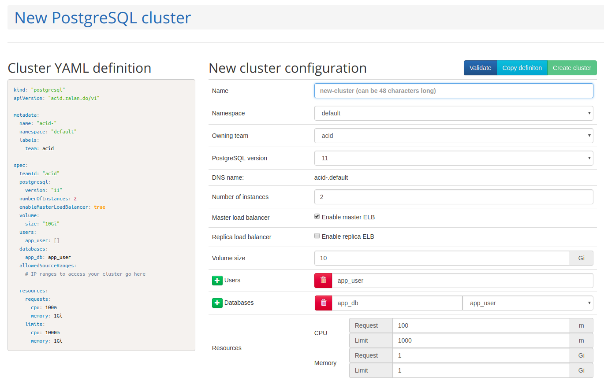
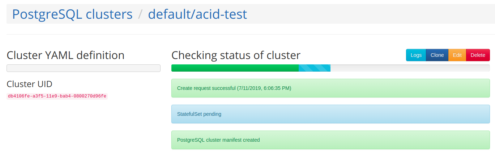
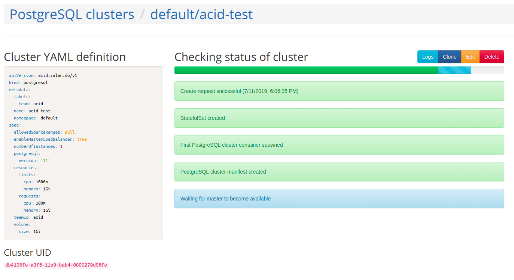
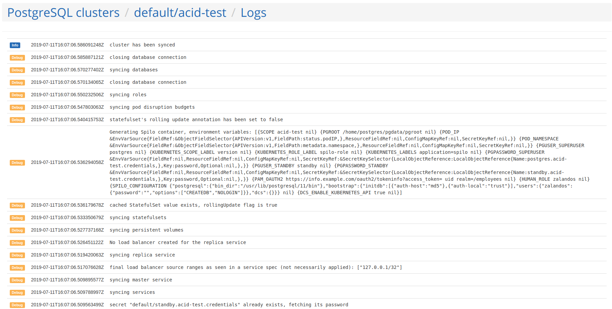
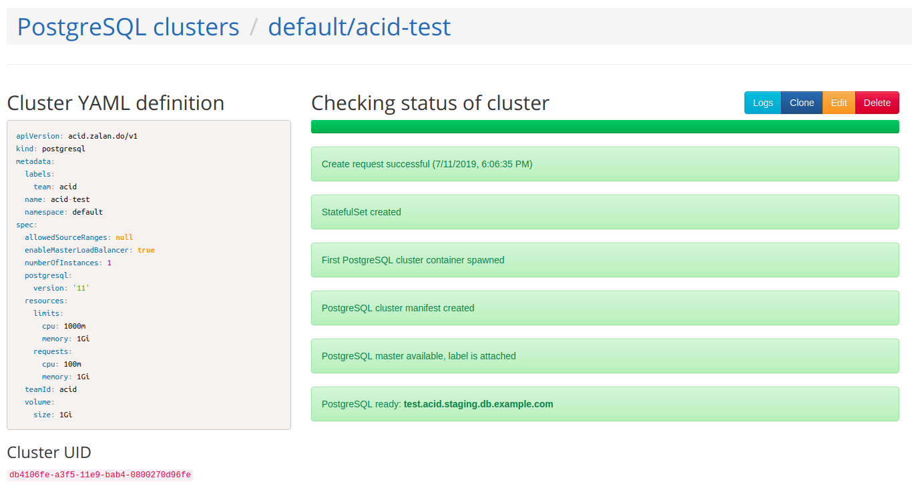
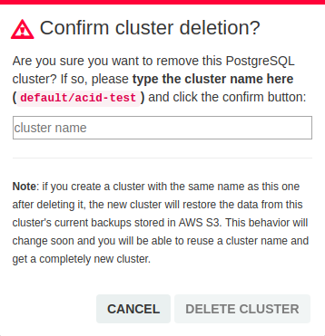

<h1>Postgres Operator UI</h1>

The Postgres Operator UI provides a graphical interface for a convenient
database-as-a-service user experience. Once the operator is set up by database
and/or Kubernetes (K8s) admins it's very easy for other teams to create, clone,
watch, edit and delete their own Postgres clusters. Information on the setup
and technical details can be found in the [admin docs](administrator.md#setting-up-the-postgres-operator-ui).

## Create a new cluster

In the top menu select the "New cluster" option and adjust the values in the
text fields. The cluster name is composed of the team plus given name. Among the
available options are [enabling load balancers](administrator.md#load-balancers-and-allowed-ip-ranges),
[volume size](user.md#increase-volume-size),
[users and databases](user.md#manifest-roles) and
[pod resources](cluster-manifest.md#postgres-container-resources).

On the left side you will see a preview of the Postgres cluster manifest which
is applied when clicking on the green "Create cluster" button.

## Cluster starting up

After the manifest is applied to K8s the Postgres Operator will create all
necessary resources. The progress of this process can nicely be followed in UI
status page.

Usually, the startup should only take up to 1 minute. If you feel the process
got stuck click on the "Logs" button to inspect the operator logs. From the
"Status" field in the top menu you can also retrieve the logs and queue of each
worker the operator is using. The number of concurrent workers can be
[configured](reference/operator_parameters.md#general).

Once the startup has finished you will see the cluster address path. When load
balancers are enabled the listed path can be used as the host name when
connecting to PostgreSQL. But, make sure your IP is within the specified
`allowedSourceRanges`.

## Update and delete clusters

Created clusters are listed under the menu "PostgreSQL clusters". You can get
back to cluster's status page via the "Status" button. From both menus you can
choose to edit the manifest, [clone](user.md#how-to-clone-an-existing-postgresql-cluster)
or delete a cluster.

Note, that not all [manifest options](reference/cluster_manifest.md) are yet
supported in the UI. If you try to add them in the editor view it won't have an
effect. Use `kubectl` commands instead. The displayed manifest on the left side
will also show parameters patched that way.

When deleting a cluster you are asked to type in its namespace and name to
confirm the action.

