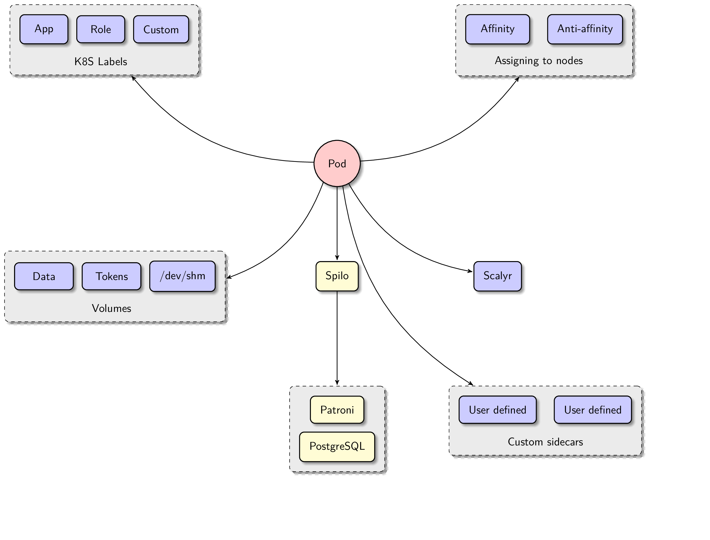

# Postgres Operator

## Introduction to the Postgres Operator

The Postgres [operator](https://coreos.com/blog/introducing-operators.html)
manages PostgreSQL clusters on Kubernetes:

1. The operator watches additions, updates, and deletions of PostgreSQL cluster
   manifests and changes the running clusters accordingly. For example, when a
   user submits a new manifest, the operator spawns a new Postgres cluster with
   necessary entities such as StatefulSets, Services, and also Postgres roles. See this
   [Postgres cluster manifest](manifests/complete-postgres-manifest.yaml)
   for settings that a manifest may contain.

2. The operator also watches updates to [its own configuration](manifests/configmap.yaml)
   and alters running Postgres clusters if necessary.  For instance, if a pod
   Docker image is changed, the operator carries out the rolling update. That
   is, the operator re-spawns one-by-one pods of each StatefulSet it manages
   with the new Docker image.

3. Finally, the operator periodically synchronizes the actual state of each
   Postgres cluster with the desired state defined in the cluster's manifest.

4. The operator aims to be hands free and configuration happens only via manifests and its own config.
   This enables easy integration in automated deploy pipelines with no access to Kubernetes directly.

# Getting started

For a quick first impression follow the instructions of [this](docs/quickstart.md)
tutorial.

# Google Summer of Code

The Postgres Operator made it to the [Google Summer of Code 2019](https://summerofcode.withgoogle.com/)! As a brand new mentoring organization, we are now looking for our first mentees. Check [our ideas](https://github.com/zalando/postgres-operator/blob/master/docs/gsoc-2019/ideas.md#google-summer-of-code-2019) and start discussion in [the issue tracker](https://github.com/zalando/postgres-operator/issues). And don't forget to spread a word about our GSoC participation to attract even more students.

## Table of contents

* [concepts](docs/index.md)
* [user documentation](docs/user.md)
* [administrator documentation](docs/administrator.md)
* [developer documentation](docs/developer.md)
* [operator configuration reference](docs/reference/operator_parameters.md)
* [cluster manifest reference](docs/reference/cluster_manifest.md)
* [command-line options and environment variables](docs/reference/command_line_and_environment.md)

The rest of this document is a tutorial to get you up and running locally with the operator on Minikube.

## Overview of involved entities

Here is a diagram, that summarizes what would be created by the operator, when a
new Postgres cluster CRD is submitted:

This picture is not complete without an overview of what is inside a single cluster pod, so
let's zoom in:

These two diagrams should help you to understand the basics of what kind of
functionality the operator provides.

There is a browser-friendly version of this documentation at [postgres-operator.readthedocs.io](https://postgres-operator.readthedocs.io)

## Community      

There are two places to get in touch with the community:
1. The [GitHub issue tracker](https://github.com/zalando/postgres-operator/issues)
2. The #postgres-operator slack channel under [Postgres Slack](https://postgres-slack.herokuapp.com)
